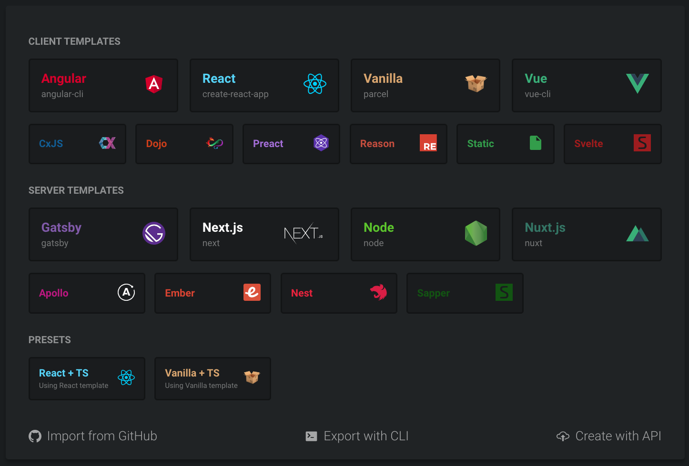

## Create Wizard

The most popular way of creating a new sandbox is the Create Wizard.



The Create Wizard shows you all public templates that are currently available, and takes you to the sandbox that corresponds to the template. You can edit and fork this sandbox to continue with the template.

## Import from GitHub

You can import a GitHub repository in CodeSandbox by going to the [import wizard](https://codesandbox.io/s/github) and giving the URL to your GitHub repository. Note that we just take the last part of the url (everything after github.com) and paste it after codesandbox.io/s/github/. We support custom branches and subdirectories as well. Here is an example URL: [https://codesandbox.io/s/github/reactjs/redux/tree/master/examples/todomvc](https://codesandbox.io/s/github/reactjs/redux/tree/master/examples/todomvc).

The imported repository will always stay up to date with your latest commits. This means that any change to the GitHub repository will be reflected immediately to the sandbox.

### Setting inference

We infer sandbox settings based on several files in a repository.

| Sandbox Setting             | Inferred from                                                                  |
| --------------------------- | ------------------------------------------------------------------------------ |
| Title                       | `name` field in `package.json`                                                 |
| Description                 | `description` field in `package.json`                                          |
| Tags                        | `keywords` field in `package.json`                                             |
| Dependencies                | `dependencies` and `devDependencies` fields in `package.json`                  |
| Entry file                  | `main` field in `package.json`. Otherwise defaults to default template setting |
| Template - Vue              | If there are `.vue` files.                                                     |
| Template - Preact           | If `package.json` dependencies contains `preact-cli`.                          |
| Template - React            | If `package.json` dependencies contains `react-scripts`.                       |
| Template - React-Typescript | If `package.json` dependencies contains `react-scripts-ts`.                    |
| Template - Svelte           | If `package.json` dependencies contains `svelte`.                              |

### Source

You can find the source of our git extractor [here](https://github.com/codesandbox-app/git-extractor).

## Export with CLI

You can export a local project to CodeSandbox by using our [CLI](https://github.com/codesandbox-app/codesandbox-importers/tree/master/packages/cli).

You can install our CLI by running `npm install -g codesandbox`. Then you can export a project by running `codesandbox {directory}`.

_Note: Our CLI is not updated yet and only supports `create-react-app` projects at this moment_

### Example usage

```
$ npm install -g codesandbox
$ codesandbox ./
```

## Define API

We offer an API that allows you to programatically create a sandbox. This is most often useful in documentation: code examples can generate a sandbox on the fly. You can call the endpoint `https://codesandbox.io/api/v1/sandboxes/define` both with a a `GET` and with a `POST` request.

### Supported Parameters

We currently support three extra parameters. The query accepts the same options as the [embed options](https://codesandbox.io/docs/embedding/#embed-options).

| Query Parameter | Description                                                                          | Example Input               |
| --------------- | ------------------------------------------------------------------------------------ | --------------------------- |
| `parameters`    | Parameters used to define how the sandbox should be created.                         | Example below               |
| `query`         | The query that will be used in the redirect url.                                     | `view=preview&runonclick=1` |
| `embed`         | Whether we should redirect to the embed instead of the editor.                       | `1`                         |
| `json`          | Instead of redirecting we will send a JSON reponse with `{"sandbox_id": sandboxId}`. | `1`                         |

### How it works

The API only needs one argument: `files`. This argument contains the files that will be in the sandbox, an example body would be:

```json
{
  "files": {
    "index.js": {
      "content": "console.log('hello!')",
      "isBinary": false
    },
    "package.json": {
      "content": {
        "dependencies": {}
      }
    }
  }
}
```

Every request **requires** a `package.json`. This file can either be a string or an object. We determine all information of the sandbox from the files, like we do with the GitHub import.

### GET Request

It's very hard to send the JSON parameters with a GET request, there is a chance of unescaped characters and the URL hits its limit of ~2000 characters quickly. That's why we first compress the files to a compressed `lz-string`. We offer a utility function in the `codesandbox` dependency for this. The implementation looks like this:

```js
import { getParameters } from 'codesandbox/lib/api/define';

const parameters = getParameters({
  files: {
    'index.js': {
      content: "console.log('hello')",
    },
    'package.json': {
      content: { dependencies: {} },
    },
  },
});

const url = `https://codesandbox.io/api/v1/sandboxes/define?parameters=${parameters}`;
```

#### Example Sandbox

<iframe src="https://codesandbox.io/embed/6yznjvl7nw?editorsize=50&fontsize=14&hidenavigation=1&runonclick=1" style="width:100%; height:500px; border:0; border-radius: 4px; overflow:hidden;" sandbox="allow-modals allow-forms allow-popups allow-scripts allow-same-origin"></iframe>

### POST Form

You can do the exact same steps for a POST request, but instead of a URL you'd show a form. With a POST request you can create bigger sandboxes.

#### Example Sandbox

<iframe src="https://codesandbox.io/embed/qzlp7nw34q?editorsize=70&fontsize=14&hidenavigation=1&runonclick=1" style="width:100%; height:500px; border:0; border-radius: 4px; overflow:hidden;" sandbox="allow-modals allow-forms allow-popups allow-scripts allow-same-origin"></iframe>

### Define without render

If you want to define a new sandbox without getting it rendered, you can add `?json=1` to the request. For instance `https://codesandbox.io/api/v1/sandboxes/define?json=1`. Instead of the render, the result will be json data providing you with the `id` of the new sandbox.

This is useful, for instance, if you need to create a new sandbox programatically, so you can then embed it on your site (See Embed documentation).

Both `get` and `post` requests are supported.
